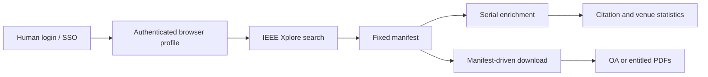

<div align="center">

# IEEE Spider

**Manifest-first IEEE Xplore collection for agents and research workflows.**

[](https://github.com/Chsier/ieee-spider/actions/workflows/ci.yml)
[](https://www.python.org/)
[](LICENSE)

Human-managed login. Authenticated IEEE search. Fixed manifests. Serial
enrichment. Citation-aware reports. Entitlement-only PDF downloads.

</div>

## Quick Start

```powershell
git clone https://github.com/Chsier/ieee-spider.git
cd ieee-spider
uv sync --python 3.12.12

uv run ieee-spider login
uv run ieee-spider auth-check

uv run ieee-spider search `
  --query "low altitude networks" `
  --from-year 2025 `
  --to-year 2026 `
  --max-results 25 `
  --output-dir data\jobs\low-altitude
```

`login` opens a visible browser for institutional SSO, MFA, and CAPTCHA.
Every other command uses one off-screen browser process and never asks the
agent to handle credentials.

## How It Works



The browser profile is a transport and authentication channel. Search,
manifest generation, enrichment, statistics, and downloads remain explicit
CLI operations, so an agent can inspect and resume each stage.

## What It Provides

| Capability | Command | Output |
| --- | --- | --- |
| Authenticated session check | `ieee-spider auth-check` | Live browser status |
| Generic IEEE search | `ieee-spider search` | JSONL, CSV, Markdown manifest |
| Configured author search | `ieee-spider fetch` | Structured author records |
| Abstract and citation enrichment | `ieee-spider enrich` | Resumable JSONL |
| Venue and citation report | `build_paper_statistics.py` | Fixed statistics JSON |
| OA and authorized PDF downloads | `ieee-spider download` | PDFs plus download manifest |
| Red-number subset export | `organize_red_downloads.py` | Fixed red-selection JSONL plus copied PDFs |

## Design Guarantees

- **IEEE-only collection.** Search and detail pages are collected from IEEE
  Xplore. There is no OpenAlex, Crossref, or other metadata fallback.
- **Human-managed authentication.** Passwords, MFA, CAPTCHA, and institutional
  SSO are completed by the user in a visible browser.
- **No proxy path.** HTTP library requests use `trust_env=False`; Edge starts
  with `--no-proxy-server`.
- **Fixed machine-readable outputs.** Search manifests, enrichment records,
  statistics, and download results are generated by scripts with stable
  schemas.
- **Serial authenticated work.** Search, detail enrichment, and authorized
  downloads use one browser profile at a time.
- **Access-control aware.** The downloader saves only OA content or PDFs that
  the authenticated account is entitled to access.

## Installation

Requirements:

- Python `3.12.12`
- [uv](https://docs.astral.sh/uv/)
- Microsoft Edge, Google Chrome, or Chromium
- A legitimate IEEE or institutional account when authorized content is needed

```powershell
uv sync --python 3.12.12
uv run ieee-spider --help
```

Windows is the primary validated platform. The Python package and CLI remain
portable to environments supported by Playwright and Python 3.12.

### Embedded Skill Runtime

The reusable skill includes a source-free Windows executable:

```text
skill/ieee-spider/
|-- bin/
|   |-- ieee-spider.exe
|   `-- runtime-manifest.json
|-- scripts/
|   `-- ieee-spider.ps1
`-- assets/default-config/
```

Use the wrapper from any working directory:

```powershell
& .\skill\ieee-spider\scripts\ieee-spider.ps1 auth-check
```

The wrapper locates the embedded executable, creates `$HOME\.ieee-spider` if
needed, bootstraps default configuration, and forwards all CLI arguments. Set
`IEEE_SPIDER_HOME` to use a different persistent workspace.

Rebuild the executable with the local Nuitka installation and shared compiler
cache:

```powershell
uv run python build_skill_exe.py
```

The executable includes the Playwright Python package and its driver. It uses
the locally installed Microsoft Edge channel, so no browser download is
required at runtime.

## Authentication

Configuration lives in [`config/login.toml`](config/login.toml). The default
mode is manual institutional login.

```powershell
uv run ieee-spider login
uv run ieee-spider auth-check
```

Successful authentication requires:

```text
authenticated: true
```

For normal HTTP 200 pages, `login` and `auth-check` require confirmation from
the live IEEE page. Saved `xpluserinfo`, `ERIGHTS`, or `SDR1` values do not
override a page that still shows `Personal Sign In` or
`Institutional Sign In`; those values can remain in storage after the server
has invalidated the session. The saved-cookie fallback is used only when IEEE
blocks automation with HTTP 403, 418, or 429.

The saved session is stored under `data/auth/`, which is ignored by Git. The
tool does not persist passwords. Form automation is optional and reads a
password only from the environment variable selected by `password_env`.

The `session` command is a human-controlled keepalive:

```powershell
uv run ieee-spider session
```

Stop `session` before starting agent-owned search, enrichment, or download
commands. The browser profile supports one process at a time.

## Search

Search by free text, title, author, DOI, venue, year, or open-access status:

```powershell
uv run ieee-spider search --query "semantic communication" --from-year 2024
uv run ieee-spider search --title "satellite networks" --author "Example Author"
uv run ieee-spider search --doi "10.1109/TWC.2020.3029143"
uv run ieee-spider search --venue "IEEE Internet of Things Journal" --from-year 2025
```

Each search writes:

```text
data/jobs/<job>/
|-- manifest.jsonl
|-- manifest.csv
`-- manifest.md
```

The JSONL and CSV files are authoritative. They are generated by the CLI and
must not be edited by hand.

## Configured Authors

The tracked [`config/authors.toml`](config/authors.toml) is intentionally empty.
Create a local configuration from the example:

```powershell
Copy-Item config\authors.example.toml config\authors.local.toml
uv run ieee-spider fetch `
  --config config\authors.local.toml `
  --max-results 200
```

Local author records can contain names, affiliations, ORCID identifiers, and
research areas. `config/authors.local.toml` is ignored by Git.

## Abstract and Citation Enrichment

IEEE search results often omit full abstracts. Enrichment visits each detail
page serially and writes a separate fixed-schema JSONL:

```powershell
uv run ieee-spider enrich `
  --input data\jobs\low-altitude\manifest.jsonl `
  --output data\jobs\low-altitude\abstracts.jsonl
```

Defaults:

- one browser context and one page
- 4 seconds between detail pages
- 20-second cooldown after every 5 records
- 60-second cooldown after HTTP 418, HTTP 429, or equivalent throttling
- resumable output that preserves successful records

Use `--retry-failed` to retry failed records and `--dry-run` to inspect pending
work without opening a browser.

Enrichment records include abstracts, `citation_count`,
`patent_citation_count`, `full_text_views`, and `citation_status`.

## Statistics

Build the fixed venue and citation report from a manifest and enrichment file:

```powershell
uv run python skill/ieee-spider/scripts/build_paper_statistics.py `
  --manifest data\jobs\low-altitude\manifest.jsonl `
  --abstracts data\jobs\low-altitude\abstracts.jsonl `
  --output data\jobs\low-altitude\statistics.json `
  --author "Example Author"
```

The report includes per-paper metrics, venue aggregates, citation coverage,
and a Top Cited ranking.

For author collections whose DOCX summaries use red-highlighted entry numbers,
copy the marked subset after the full download completes:

```powershell
uv run python skill/ieee-spider/scripts/organize_red_downloads.py `
  --author-dir data\jobs\<collection>\<author>
```

The script matches red numbers by title, reads the full-download manifest, and
writes `downloads\red\red_selection.jsonl`.

## PDF Downloads

Download open-access PDFs with bounded concurrency:

```powershell
uv run ieee-spider download `
  --input data\jobs\low-altitude\manifest.jsonl `
  --mode oa `
  --limit 5 `
  --workers 3
```

Download content accessible to the authenticated account:

```powershell
uv run ieee-spider download `
  --input data\jobs\low-altitude\manifest.jsonl `
  --mode authorized `
  --limit 5
```

Preview selected records without downloading:

```powershell
uv run ieee-spider download `
  --input data\jobs\low-altitude\manifest.jsonl `
  --mode both `
  --dry-run `
  --limit 20
```

Authorized downloads are serial. They default to a 4-second delay, a
60-second throttling cooldown, and at most 2 attempts per record. IEEE
`stamp.jsp` and `stampPDF/getPDF.jsp` responses are resolved through the
authenticated request context without navigating the browser into the PDF
viewer. A file is recorded as downloaded only after the response begins with
`%PDF-`.

Results are written to:

```text
downloads/
|-- <paper>.pdf
|-- download_manifest.jsonl
`-- download_manifest.csv
```

Download manifests merge by `record_id`, so interrupted batches and smaller
resume runs do not erase earlier successes.

## Repository Layout

```text
.
|-- config/                 Login and optional author configuration
|-- src/ieee_spider/        Python package and CLI
|-- skill/ieee-spider/      Reusable Codex skill and report scripts
|-- tests/                  Unit and contract tests
|-- data/                   Runtime data, ignored by Git
|-- downloads/              Downloaded PDFs, ignored by Git
`-- .github/workflows/      CI
```

## Security and Privacy

- Never commit `data/`, `downloads/`, `config/authors.local.toml`,
  `config/login.local.toml`, browser profiles, cookies, or credentials.
- The repository intentionally contains no downloaded papers, user summaries,
  account identifiers, ORCID records, or institution-specific configuration.
- Do not bypass paywalls, DRM, CAPTCHA, MFA, rate limits, or account
  entitlements.
- Do not use a proxy to evade access controls or local network policy.
- Report vulnerabilities through GitHub private security advisories rather
  than a public issue.

See [`SECURITY.md`](SECURITY.md) for the full policy.

## Development

Run the complete test suite:

```powershell
uv run pytest -q
```

Current suite:

```text
...................................... [100%]
38 passed
```

GitHub Actions runs the same tests on pushes and pull requests.

## Contributing

See [`CONTRIBUTING.md`](CONTRIBUTING.md) before submitting a change. Keep
network access serial, preserve the fixed manifest contracts, and add tests for
parser or authentication changes.

## License

MIT. See [`LICENSE`](LICENSE).
